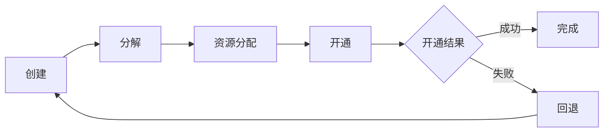

# Order Management

> 订单管理系统，处理从 CRM 受理的业务订单，分解为开通指令，与 OSS 交互完成服务开通。

## 核心职责

- 订单接收（从 CRM）
- 订单分解（将复合订单拆分为多个子订单）
- 资源分配（号码、IP、VLAN 等资源分配）
- 服务开通（与 OSS 交互开通服务）
- 订单跟踪（全流程状态跟踪）
- 订单回退（开通失败回退）

## 订单生命周期

## 待补充

- 订单分解规则
- 资源管理流程
- 与 OSS 的接口（如 Service Order）

